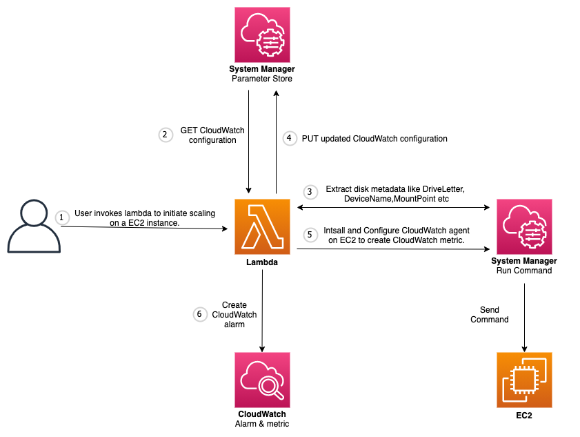
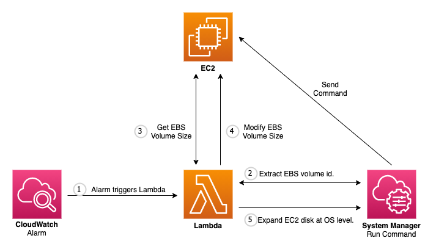

# Automation to scale-up EBS volume


## Architecture
**Initiate scale up**

### How it works
1. User invokes Lambda `create-metric-alarm-function`.
2. Lambda makes a call to System Manager (Parameter Store) to read CloudWatch agent config file `/CWAgent/[Linux|Windows]/Disk`.
3. Lambda sends command to System Manager (Run Command) to extract disk metadata like Device Name,  Mount Point etc.
4. Lambda updates the CloudWatch agent config file with disk metadata.
5. Lambda sends command to System Manager to install and configure CloudWatch agent using document `CloudWatchAgent` and parameter `/CWAgent/[Linux|Windows]/Disk`. This step will create disk utilisation metric in CloudWatch for each mount point. It might take 3-5 minutes before metric appear in CloudWatch under namespace `CWAgent`.
6. Creates a CloudWatch alarm on the utilisation metric created in previous step. Name of the alarm will start with `ebs-utilisation-exceeded-alarm:[instance_id]:[device_name]`.

**Scale up volume**

### How It Works
1. When disk utilisation crosses threshold it invokes Lambda `scale-ebs-function` using SNS Topic `ebs-utilisation-exceeded-topic`.
2. Lambda sends command to System Manager (Run Command) to extract EBS volume id associated with the disk using commands like `lsblk`, `Get-Partition` etc.
3. Lambda extract current size of EBS volume.
4. Lambda modifies the volume size of the EBS volume.
5. To expand disk at OS level, Lambda sends command to System Manager Run Command.

## Installation
This solution can be build either by deploying cdk stack from your environment or by using cloudformation template already synthesized.

### CDK Stack
To install using cdk stack

1. Clone this repository to your local machine.

    ```
    $ git clone https://github.com/avanishkyadav/ebs-scale-up-automation.git
    ```
   
2.  Install cdk if you don’t have it already installed.
    
    ```
    $ npm install -g aws-cdk
    ```

3.  If this is first time you are using cdk then, run cdk bootstrap.
    
    ```
    $ cdk bootstrap
    ```

4.  Make sure you in root directory.
    
    ```
    $ cd ebs-scale-up-automation
    ```
   
5.  Activate virtual environment.
    
    ```
    $ source .venv/bin/activate
    ```

6.  Install any dependencies.
    
    ```
    $ pip install -r requirements.txt
    ```

7.  List stacks. This will list out the stacks present in the project. In this case the only stack will be `ebs-scale-up-automation`.
    
    ```
    $ cdk ls
    ```

8.  Synthesize cloudformation templates. The templates will be generated in `cdk.out/` directory.

    ```
    $ cdk synth 
    ```

9.  Deploying the stacks to create resources. List of [parameters](#stack-parameters) for each stacks.
    
    ```
    $ cdk deploy <stack-name> --parameters "<stack-name>:<parameter-name>=<parameter-value>"
    # e.g, cdk deploy ebs-scale-up-automation --parameters "ebs-scale-up-automation:TargetUtilisationPercent=70" --parameters "ebs-scale-up-automation:ThresholdUtilisationPercent=90"
    ```

### CloudFormation Template 
To install using cloudformation template

1. Upload file `ebs-scale-up.zip` to a bucket. Tow download file click [here](https://automation-assets-avaya.s3.ap-south-1.amazonaws.com/lambda-archives/ebs-scale-up.zip).
2. To launch CloudFormation stack, click  [here](https://console.aws.amazon.com/cloudformation/home?#/stacks/new?stackName=ebs-scale-up-automation&templateURL=https://automation-assets-avaya.s3.ap-south-1.amazonaws.com/cftemplates/ebs-scale-up-automation.template.json).
3. Fill out parameters value. List of [parameters](#stack-parameters) for each stacks.

## Resources
Following table contains list of the primary resources created.
| Name | Type | Description |
| ----------- | ----------- | ----------- |
| create-ebs-metric-alarm-function | Lambda Function | This function initiate EBS scale-up automation on EC2 by launching CloudWatch agent to create utilisation metric and creating CloudWatch alarm on metric. |
| scale-ebs-function | Lambda Function | This function scale up the EBS by first modifying volume and then expanding disk at OS level. |
| ebs-utilisation-exceeded-topic | SNS Topic | This is the topic that CloudWatch Alarm uses to trigger function `scale-ebs-function`. |
| /CWAgent/Windows/Disk | System Manager Parameter Store | This stores cloudwatch agent configuration of disk for windows machine.  |
| /CWAgent/Linux/Disk | System Manager Parameter Store | This stores cloudwatch agent configuration of disk for linux machine. |
| CloudWatchAgent | System Manager Document | This is a composite SSM document which installs and configure CloudWatch agent on EC2. |

##  Implementation
- To implement automation on instances. Create following test event in `create-metric-alarm-function` and invoke the function.
  ```
  {
    "InstanceIds": ["instance_id_1","instance_id_2","instance_id_3"]
  }
  ```
- To implement automation on every instance in AWS account. Create following test event in `create-metric-alarm-function`.
  ```
  {
    "InstanceIds": "*"
  }
  ```
- Note - When `create-metric-alarm-function` is invoked it creates metric and alarm only for current EBS volumes attached to EC2. So in future if further volumes are attached to EC2, then you have to run this function again for this instance.

## Stack Parameters
Prameters required for stack creation.
| Parameter Name | Description |
| ----------- | ----------- |
| BucketName |	Bucket where `ebs-scale-up.zip` file is uploaded. (Remark - Applicable only if installing with CloudFormation Template.) |
| KeyName | S3 Key name of the file `ebs-scale-up.zip`.  (Remark - Applicable only if installing with CloudFormation Template. Default - `ebs-scale-up.zip`) |
| EnableNotification | Publish scaling summary to NotificationTopicArn. |
| NotificationTopicArn | SNS topic arn to which notification will be published. |
| TargetUtilisationPercent | Target utilisation which must be achieved after scale out happen. `[1-100]`` |
| ThresholdUtilisationPercent | Time at which scale-out of read replicas will take place. `[1-100]`` |

